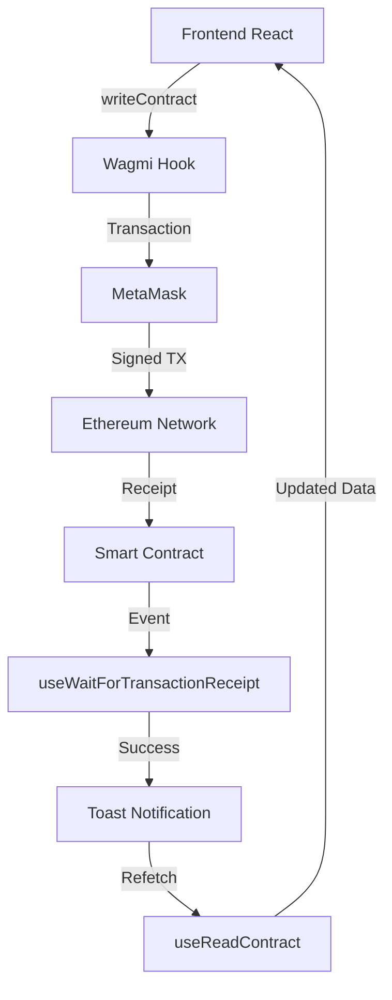

# 🏠 RentChain - Plataforma Descentralizada de Aluguel de Imóveis

Uma plataforma completa de aluguel de imóveis descentralizada, composta por um **frontend Web3** moderno em Next.js e um **smart contract** robusto em Solidity. Este projeto permite que proprietários cadastrem imóveis e inquilinos aluguem usando ETH, com taxa automática de 2% para a plataforma.

## 📁 Estrutura do Projeto

```
fb03/
├── rent/                           # Frontend Web3 (Next.js + TypeScript)
│   ├── src/
│   │   ├── app/                    # App Router do Next.js 15
│   │   ├── components/             # Componentes React reutilizáveis
│   │   ├── hooks/                  # Custom hooks para Web3
│   │   ├── config/                 # Configurações (Wagmi, chains)
│   │   ├── contracts/              # ABIs e endereços dos contratos
│   │   ├── types/                  # TypeScript definitions
│   │   ├── utils/                  # Utilitários (conversões ETH/wei)
│   │   └── store/                  # Gerenciamento de estado (Zustand)
│   ├── package.json               # Dependências e scripts
│   └── README.md
│
├── property-rental-contract/       # Smart Contract (Foundry + Solidity)
│   ├── src/
│   │   └── PropertyRental.sol      # Contrato principal
│   ├── script/
│   │   └── DeployPropertyRental.s.sol # Script de deploy
│   ├── test/
│   │   └── PropertyRental.t.sol    # Testes automatizados
│   ├── foundry.toml               # Configuração do Foundry
│   └── README.md
│
└── README.md                      # Este arquivo (documentação geral)
```

---

## 🎯 Funcionalidades Principais

### 🔗 **Web3 Integration**
- Conexão obrigatória via **MetaMask/WalletConnect**
- Suporte às redes **Sepolia (testnet)** e **Mainnet**
- Estado de conexão persistente
- Feedback visual de status da carteira

### 🏘️ **Para Proprietários**
- ✅ **Cadastrar Imóveis**: Descrição, imagem, tipo, preço/dia, dias disponíveis
- ✅ **Gerenciar Propriedades**: Visualizar imóveis cadastrados
- ✅ **Histórico de Aluguéis**: Ver quem alugou e quando
- ✅ **Recebimento Automático**: 98% do valor vai direto para o proprietário

### 🔍 **Para Inquilinos**
- ✅ **Explorar Imóveis**: Grid responsivo com filtros
- ✅ **Busca Avançada**: Por preço, disponibilidade, tipo
- ✅ **Aluguel Seguro**: Cálculo automático de custos
- ✅ **Preview de Taxas**: Transparência total dos valores

### ⚡ **Funcionalidades Automáticas**
- ✅ **Taxa da Plataforma**: 2% deduzidos automaticamente
- ✅ **Validações**: Proprietário não pode alugar próprio imóvel
- ✅ **Gestão de Disponibilidade**: Imóveis ficam indisponíveis após aluguel
- ✅ **Devolução de Troco**: ETH excedente retornado automaticamente

---

## 🖥️ **FRONTEND (rent/)** - Análise Detalhada

### 🚀 **Tecnologias Utilizadas**

| Categoria | Tecnologia | Versão | Função |
|-----------|------------|--------|---------|
| **Framework** | Next.js | 15.4.6 | App Router, SSR, Performance |
| **Linguagem** | TypeScript | ^5 | Type Safety, Developer Experience |
| **Styling** | TailwindCSS | ^4 | Utility-first CSS, Responsividade |
| **Componentes** | Shadcn/ui | - | Design System, Acessibilidade |
| **Web3** | Wagmi | ^2.16.2 | React Hooks para Ethereum |
| **Web3** | Viem | ^2.33.3 | TypeScript-first Ethereum Library |
| **Validação** | Zod | ^4.0.17 | Schema Validation |
| **Formulários** | React Hook Form | ^7.62.0 | Formulários performáticos |
| **Estado** | Zustand | ^5.0.7 | State Management |
| **Queries** | TanStack Query | ^5.84.2 | Server State Management |
| **Notificações** | Sonner | ^2.0.7 | Toast Notifications |
| **Ícones** | Lucide React | ^0.539.0 | Icon Library |

### 🏗️ **Arquitetura do Frontend**

#### **1. App Router Structure (src/app/)**
```typescript
// layout.tsx - Layout raiz com providers
import { Providers } from '@/components/Providers'
import { Toaster } from '@/components/ui/sonner'

export default function RootLayout({ children }) {
  return (
    <html lang="en">
      <body>
        <Providers>          {/* Web3 + React Query */}
          {children}
          <Toaster />        {/* Notificações globais */}
        </Providers>
      </body>
    </html>
  )
}
```

#### **2. Providers Configuration (src/components/Providers.tsx)**
```typescript
// Configuração dos providers Web3 e React Query
export function Providers({ children }) {
  const [queryClient] = useState(() => new QueryClient({
    defaultOptions: {
      queries: {
        refetchOnWindowFocus: false,
        retry: 2,
        staleTime: 20000,        // Cache por 20 segundos
        gcTime: 5 * 60 * 1000,   // Garbage collection em 5 min
      },
    },
  }))

  return (
    <WagmiProvider config={config}>
      <QueryClientProvider client={queryClient}>
        {children}
      </QueryClientProvider>
    </WagmiProvider>
  )
}
```

#### **3. Configuração Web3 (src/config/wagmi.ts)**
```typescript
// Configuração das chains e conectores
export const config = createConfig({
  chains: [sepolia, mainnet],
  connectors: [
    injected(),              // Carteiras injetadas (MetaMask, etc.)
    metaMask(),             // MetaMask específico
  ],
  transports: {
    [sepolia.id]: http(sepoliaRpcUrl),
    [mainnet.id]: http(),
  },
})
```

### 🎨 **Componentes Principais**

#### **1. PropertyCard.tsx - Card de Imóvel**
```typescript
export function PropertyCard({ property }: PropertyCardProps) {
  const { address, isConnected } = useAccount()
  const { rentProperty, isPending } = useRentProperty()
  
  const isOwner = address === property.owner
  const canRent = isConnected && !isOwner && property.isAvailable
  
  // Cálculos de preço em tempo real
  const dailyRateWei = BigInt(property.dailyRate)
  const totalCostWei = dailyRateWei * BigInt(parseInt(rentalDays || '1'))
  const totalCostEth = weiToEther(totalCostWei)
```

**Funcionalidades:**
- ✅ **Cálculo Dinâmico**: Preço total atualiza conforme dias selecionados
- ✅ **Validações de Estado**: Verifica se usuário pode alugar
- ✅ **UI Responsiva**: Cards adaptam-se a diferentes telas
- ✅ **Loading States**: Feedback visual durante transações

#### **2. PropertyListing.tsx - Listagem de Imóveis**
```typescript
export function PropertyListing() {
  const { data: properties, isLoading } = useGetAllProperties()
  const [filters, setFilters] = useState({
    search: '',
    minPrice: '',
    maxPrice: '',
    propertyType: 'all',
    availability: 'all'
  })
```

**Funcionalidades:**
- ✅ **Filtros Avançados**: Por preço, tipo, disponibilidade
- ✅ **Busca em Tempo Real**: Debounce para performance
- ✅ **Grid Responsivo**: 3 colunas desktop, 1 coluna mobile
- ✅ **Skeleton Loading**: Placeholder durante carregamento

#### **3. PropertyRegistration.tsx - Cadastro de Imóveis**
```typescript
const schema = z.object({
  description: z.string().min(10, 'Descrição deve ter pelo menos 10 caracteres'),
  imageUrl: z.string().url('URL da imagem inválida'),
  propertyType: z.string().min(1, 'Selecione o tipo do imóvel'),
  dailyRateEth: z.number().min(0.001, 'Valor mínimo: 0.001 ETH'),
  availableDays: z.number().min(1).max(365, 'Máximo 365 dias')
})
```

**Funcionalidades:**
- ✅ **Validação Robusta**: Schema validation com Zod
- ✅ **Formulário Tipado**: Type-safe com React Hook Form
- ✅ **Feedback Visual**: Estados de loading e erro
- ✅ **Conversão Automática**: ETH ↔ Wei transparente

### 🔧 **Custom Hooks (src/hooks/usePropertyRental.ts)**

#### **Hook para Leitura de Dados**
```typescript
export function useGetAllProperties() {
  const result = useReadContract({
    address: PROPERTY_RENTAL_ADDRESS,
    abi: PROPERTY_RENTAL_ABI,
    functionName: 'getAllProperties',
    chainId: sepolia.id,
    query: {
      refetchInterval: 30000,    // Atualiza a cada 30s
      staleTime: 20000,         // Cache por 20s
    }
  })

  return {
    ...result,
    data: result.data?.map(convertContractPropertyToFrontend) || []
  }
}
```

#### **Hook para Escritas (Transações)**
```typescript
export function useRegisterProperty() {
  const { writeContract, data: hash, isPending } = useWriteContract()
  const { isLoading: isConfirming, isSuccess } = useWaitForTransactionReceipt({
    hash,
  })

  const registerProperty = async (description, imageUrl, propertyType, dailyRateEth, availableDays) => {
    const dailyRateWei = parseEther(dailyRateEth.toString())
    
    writeContract({
      address: PROPERTY_RENTAL_ADDRESS,
      abi: PROPERTY_RENTAL_ABI,
      functionName: 'registerProperty',
      args: [description, imageUrl, propertyType, dailyRateWei, BigInt(availableDays)],
      chainId: sepolia.id,
    })
  }
```

### 🛠️ **Utilitários (src/utils/ethereum.ts)**

```typescript
// Conversões ETH ↔ Wei
export function weiToEther(wei: bigint): number {
  return parseFloat(formatEther(wei))
}

// Formatação de endereços
export function formatWalletAddress(address: string): string {
  return `${address.slice(0, 6)}...${address.slice(-4)}`
}

// Conversão de dados do contrato para frontend
export function convertContractPropertyToFrontend(contractProperty: any): Property {
  return {
    id: contractProperty.id.toString(),
    owner: contractProperty.owner,
    description: contractProperty.description,
    imageUrl: contractProperty.imageUrl,
    propertyType: contractProperty.propertyType,
    dailyRate: contractProperty.dailyRate.toString(), // Mantém como string para BigInt
    availableDays: Number(contractProperty.availableDays),
    isAvailable: contractProperty.isAvailable,
    createdAt: Number(contractProperty.createdAt),
  }
}
```

### 📱 **Responsividade e UX**

#### **Design System**
- ✅ **Mobile-First**: Desenvolvido primeiro para mobile
- ✅ **Breakpoints**: sm (640px), md (768px), lg (1024px), xl (1280px)
- ✅ **Touch-Friendly**: Targets de toque mínimo 44px
- ✅ **Dark/Light Mode**: Suporte a temas com next-themes

#### **Micro-interactions**
```css
/* Exemplo de animações responsivas */
.property-card {
  @apply transition-all duration-300 hover:scale-105;
  @apply hover:shadow-lg active:scale-95;
}

.button-primary {
  @apply bg-blue-600 hover:bg-blue-700 active:bg-blue-800;
  @apply transform transition-transform active:scale-95;
}
```

---

## ⚡ **SMART CONTRACT (property-rental-contract/)** - Análise Detalhada

### 🏗️ **Arquitetura do Contrato**

#### **Estruturas de Dados**
```solidity
struct Property {
    uint256 id;                    // ID único incremental
    address owner;                 // Proprietário do imóvel
    string description;            // Descrição do imóvel
    string imageUrl;              // URL da imagem
    string propertyType;          // Tipo (apartamento, casa, etc.)
    uint256 dailyRate;            // Diária em wei
    uint256 availableDays;        // Dias disponíveis para aluguel
    bool isAvailable;             // Status de disponibilidade
    uint256 createdAt;            // Timestamp de criação
}

struct Rental {
    uint256 propertyId;           // ID do imóvel alugado
    address renter;               // Endereço do locatário
    uint256 startDate;            // Data de início
    uint256 rentalDays;           // Dias alugados
    uint256 totalAmount;          // Valor total pago
    bool isActive;                // Status do aluguel
}
```

#### **Variáveis de Estado**
```solidity
address public owner;                              // Dono da plataforma
uint256 public constant PLATFORM_FEE = 200;       // 2% (200 basis points)
uint256 public constant BASIS_POINTS = 10000;     // Base para porcentagem

uint256 private propertyCounter;                   // Contador de imóveis
uint256 private rentalCounter;                     // Contador de aluguéis

// Mappings para organização dos dados
mapping(uint256 => Property) public properties;
mapping(address => uint256[]) public ownerProperties;
mapping(uint256 => Rental) public rentals;
mapping(address => uint256) public platformEarnings;

uint256[] public allPropertyIds;                   // Lista global de IDs
```

### 🔐 **Segurança e Validações**

#### **Modifiers de Proteção**
```solidity
modifier onlyOwner() {
    require(msg.sender == owner, "Apenas o dono da plataforma pode executar esta funcao");
    _;
}

modifier propertyExists(uint256 _propertyId) {
    require(_propertyId > 0 && _propertyId <= propertyCounter, "Imovel nao existe");
    _;
}
```

#### **Padrões de Segurança Implementados**

1. **Checks-Effects-Interactions Pattern**
```solidity
function rentProperty(uint256 _propertyId, uint256 _days) external payable {
    // 1. CHECKS - Todas as validações primeiro
    require(property.isAvailable, "Imovel nao esta disponivel");
    require(property.owner != msg.sender, "Proprietario nao pode alugar seu proprio imovel");
    require(msg.value >= totalCost, "Valor enviado insuficiente");
    
    // 2. EFFECTS - Mudanças de estado
    property.isAvailable = false;
    platformEarnings[owner] += platformFee;
    
    // 3. INTERACTIONS - Chamadas externas por último
    payable(property.owner).transfer(ownerAmount);
}
```

2. **Reentrancy Protection**
```solidity
function collectPlatformFees() external onlyOwner {
    uint256 amount = platformEarnings[owner];
    platformEarnings[owner] = 0;        // Zera ANTES da transferência
    payable(owner).transfer(amount);    // Transfere depois
}
```

3. **Integer Overflow Protection**
- Solidity ^0.8.19 tem proteção automática
- Operações matemáticas revertem em overflow/underflow

### 💰 **Sistema de Taxas e Pagamentos**

#### **Cálculo da Taxa (2%)**
```solidity
uint256 totalCost = property.dailyRate * _days;
uint256 platformFee = (totalCost * PLATFORM_FEE) / BASIS_POINTS;  // 2%
uint256 ownerAmount = totalCost - platformFee;                    // 98%
```

**Exemplo numérico:**
- Diária: 0.1 ETH
- Dias: 5
- Total: 0.5 ETH
- Taxa da plataforma: 0.01 ETH (2%)
- Para o proprietário: 0.49 ETH (98%)

#### **Fluxo de Pagamento**
```solidity
// Registra ganhos da plataforma
platformEarnings[owner] += platformFee;

// Transfere para o proprietário
payable(property.owner).transfer(ownerAmount);

// Devolve troco se necessário
if (msg.value > totalCost) {
    payable(msg.sender).transfer(msg.value - totalCost);
}
```

### 📊 **Funções Principais Explicadas**

#### **1. registerProperty() - Cadastrar Imóvel**
```solidity
function registerProperty(
    string memory _description,
    string memory _imageUrl,
    string memory _propertyType,
    uint256 _dailyRate,
    uint256 _availableDays
) external returns (uint256) {
    // Validações de entrada
    require(bytes(_description).length > 0, "Descricao nao pode estar vazia");
    require(_dailyRate > 0, "Valor da diaria deve ser maior que zero");
    
    // Gera ID único
    propertyCounter++;
    uint256 newPropertyId = propertyCounter;
    
    // Cria estrutura do imóvel
    properties[newPropertyId] = Property({
        id: newPropertyId,
        owner: msg.sender,
        description: _description,
        imageUrl: _imageUrl,
        propertyType: _propertyType,
        dailyRate: _dailyRate,
        availableDays: _availableDays,
        isAvailable: true,
        createdAt: block.timestamp
    });
    
    // Adiciona aos arrays de controle
    ownerProperties[msg.sender].push(newPropertyId);
    allPropertyIds.push(newPropertyId);
    
    emit PropertyRegistered(newPropertyId, msg.sender, _propertyType, _dailyRate);
    return newPropertyId;
}
```

**O que acontece:**
1. ✅ Valida todos os campos obrigatórios
2. ✅ Gera ID único incremental
3. ✅ Armazena dados no mapping `properties`
4. ✅ Adiciona às listas de controle para buscas
5. ✅ Emite evento para o frontend
6. ✅ Retorna ID para confirmação

#### **2. rentProperty() - Alugar Imóvel**
```solidity
function rentProperty(uint256 _propertyId, uint256 _days) 
    external 
    payable 
    propertyExists(_propertyId) 
{
    Property storage property = properties[_propertyId];
    
    // Validações de negócio
    require(property.isAvailable, "Imovel nao esta disponivel");
    require(property.owner != msg.sender, "Proprietario nao pode alugar seu proprio imovel");
    require(_days > 0 && _days <= property.availableDays, "Quantidade de dias invalida");
    
    // Cálculos financeiros
    uint256 totalCost = property.dailyRate * _days;
    uint256 platformFee = (totalCost * PLATFORM_FEE) / BASIS_POINTS;
    uint256 ownerAmount = totalCost - platformFee;
    
    require(msg.value >= totalCost, "Valor enviado insuficiente");
    
    // Registra o aluguel
    rentalCounter++;
    rentals[rentalCounter] = Rental({
        propertyId: _propertyId,
        renter: msg.sender,
        startDate: block.timestamp,
        rentalDays: _days,
        totalAmount: totalCost,
        isActive: true
    });
    
    // Atualiza estados
    property.isAvailable = false;
    platformEarnings[owner] += platformFee;
    
    // Transferências
    payable(property.owner).transfer(ownerAmount);
    if (msg.value > totalCost) {
        payable(msg.sender).transfer(msg.value - totalCost);
    }
    
    emit PropertyRented(_propertyId, rentalCounter, msg.sender, _days, totalCost);
}
```

**O que acontece:**
1. ✅ Valida se imóvel existe e está disponível
2. ✅ Impede proprietário de alugar próprio imóvel
3. ✅ Calcula custos e taxas automaticamente
4. ✅ Registra o aluguel com timestamp
5. ✅ Marca imóvel como indisponível
6. ✅ Distribui pagamentos (98% proprietário, 2% plataforma)
7. ✅ Retorna troco se necessário

### 🧪 **Testes Automatizados**

O contrato possui **5 testes principais** em `PropertyRental.t.sol`:

#### **1. test_RegisterProperty_Success**
```solidity
function test_RegisterProperty_Success() public {
    uint256 propertyId = propertyRental.registerProperty(
        "Casa moderna",
        "https://image.url",
        "casa",
        0.1 ether,
        30
    );
    
    // Verifica se foi registrado corretamente
    assertEq(propertyId, 1);
    (uint256 id, address owner, string memory description, , , uint256 dailyRate, , bool isAvailable,) = 
        propertyRental.properties(propertyId);
    
    assertEq(id, 1);
    assertEq(owner, address(this));
    assertEq(description, "Casa moderna");
    assertEq(dailyRate, 0.1 ether);
    assertTrue(isAvailable);
}
```

#### **2. test_RentProperty_Success**
```solidity
function test_RentProperty_Success() public {
    // Registra propriedade
    uint256 propertyId = propertyRental.registerProperty(
        "Casa moderna", "https://image.url", "casa", 0.1 ether, 30
    );
    
    // Muda para outro usuário
    vm.prank(renter);
    vm.deal(renter, 1 ether);
    
    // Aluga por 3 dias
    propertyRental.rentProperty{value: 0.3 ether}(propertyId, 3);
    
    // Verifica se foi alugado
    (, , , , , , , bool isAvailable,) = propertyRental.properties(propertyId);
    assertFalse(isAvailable);
}
```

#### **3. test_RentProperty_OwnerCannotRentOwnProperty**
```solidity
function test_RentProperty_OwnerCannotRentOwnProperty() public {
    uint256 propertyId = propertyRental.registerProperty(
        "Casa moderna", "https://image.url", "casa", 0.1 ether, 30
    );
    
    // Tenta alugar próprio imóvel
    vm.expectRevert("Proprietario nao pode alugar seu proprio imovel");
    propertyRental.rentProperty{value: 0.1 ether}(propertyId, 1);
}
```

### 🚀 **Deploy e Configuração**

#### **Script de Deploy (script/DeployPropertyRental.s.sol)**
```solidity
contract DeployPropertyRental is Script {
    function run() external {
        vm.startBroadcast();
        
        PropertyRental propertyRental = new PropertyRental();
        
        console.log("PropertyRental deployed at:", address(propertyRental));
        console.log("Owner:", propertyRental.owner());
        
        vm.stopBroadcast();
    }
}
```

#### **Comandos de Deploy**

**Deploy Local (Anvil):**
```bash
# 1. Inicia blockchain local
anvil

# 2. Deploy do contrato
forge script script/DeployPropertyRental.s.sol:DeployPropertyRental \
  --rpc-url http://localhost:8545 \
  --private-key 0xac0974bec39a17e36ba4a6b4d238ff944bacb478cbed5efcae784d7bf4f2ff80 \
  --broadcast
```

**Deploy Sepolia (Testnet):**
```bash
forge script script/DeployPropertyRental.s.sol:DeployPropertyRental \
  --rpc-url $SEPOLIA_RPC_URL \
  --private-key $PRIVATE_KEY \
  --broadcast \
  --verify
```

### 📈 **Otimizações de Gas**

1. **Storage vs Memory Usage**
```solidity
Property storage property = properties[_propertyId];  // Referência direta (barato)
Property[] memory allProps = new Property[](length);  // Array temporário (caro, mas necessário)
```

2. **Packed Structs**
```solidity
struct Property {
    uint256 id;           // slot 1
    address owner;        // slot 2 (20 bytes)
    bool isAvailable;     // slot 2 (1 byte) - packed com address
    uint256 createdAt;    // slot 3
    // strings ocupam slots separados conforme tamanho
}
```

3. **Efficient Loops**
```solidity
// Evita loops custosos usando mappings
mapping(uint256 => Property) public properties;  // O(1) lookup
uint256[] public allPropertyIds;                 // Array para iteração quando necessário
```

---

## 🔄 **Integração Frontend ↔ Smart Contract**

### 📡 **Fluxo de Dados**



### 🔧 **Configuração de Endereços**

```typescript
// src/contracts/PropertyRental.ts
export const PROPERTY_RENTAL_ADDRESS = '0x...' as const
export const PROPERTY_RENTAL_ABI = [...] as const
```

### 🎯 **Conversões ETH ↔ Wei**

```typescript
// Frontend para Contrato (ETH → Wei)
const dailyRateWei = parseEther(dailyRateEth.toString())

// Contrato para Frontend (Wei → ETH)
const dailyRateEth = parseFloat(formatEther(dailyRateWei))
```

### ⚡ **Estados de Loading**

```typescript
export function PropertyCard() {
  const { rentProperty, isPending, isConfirming, isSuccess } = useRentProperty()
  
  const buttonText = () => {
    if (isPending) return 'Preparando...'
    if (isConfirming) return 'Confirmando...'
    if (isSuccess) return 'Alugado!'
    return 'Alugar'
  }
}
```

---

## 📚 **Guia Para Iniciantes**

### 🤔 **O que é uma DApp (Aplicação Descentralizada)?**

Uma DApp é como um aplicativo normal, mas em vez de armazenar dados em servidores de empresas, ela armazena na **blockchain** - uma rede descentralizada que ninguém controla.

**Componentes:**
- **Frontend** (rent/): Interface que você vê e usa
- **Smart Contract** (property-rental-contract/): Programa que roda na blockchain
- **Carteira** (MetaMask): Sua "conta" para assinar transações

### 💰 **Como Funciona o Dinheiro (ETH)**

- **ETH**: Moeda do Ethereum (como Real/Dólar)
- **Wei**: Menor unidade do ETH (como centavos)
- **1 ETH = 1.000.000.000.000.000.000 wei** (18 zeros!)

**Por que usar Wei?**
Computadores são melhores com números inteiros. Em vez de "0.005 ETH", usamos "5000000000000000 wei".

### 🏠 **Como Funciona o Aluguel**

1. **Proprietário cadastra** imóvel com preço por dia
2. **Inquilino escolhe** quantos dias quer alugar
3. **Smart contract calcula** automaticamente:
   - Total = preço_dia × dias
   - Taxa plataforma = 2% do total
   - Para proprietário = 98% do total
4. **Pagamento é dividido** automaticamente
5. **Imóvel fica indisponível** após aluguel

### 🔐 **Segurança Automática**

O smart contract tem regras que **ninguém pode burlar**:
- ❌ Proprietário não pode alugar próprio imóvel
- ✅ Pagamento deve ser suficiente
- ✅ Taxa de 2% é sempre cobrada
- ✅ Troco é devolvido se enviar ETH a mais
- ✅ Apenas dono da plataforma pode sacar taxas

---

## 🛠️ **Como Rodar o Projeto**

### 📋 **Pré-requisitos**

```bash
# 1. Instalar Node.js (para o frontend)
curl -fsSL https://deb.nodesource.com/setup_18.x | sudo -E bash -
sudo apt-get install -y nodejs

# 2. Instalar Foundry (para smart contracts)
curl -L https://foundry.paradigm.xyz | bash
foundryup

# 3. Instalar uma carteira (MetaMask)
# Vá para https://metamask.io e instale a extensão
```

### 🚀 **Rodando Localmente**

#### **1. Smart Contract (Blockchain Local)**
```bash
# Terminal 1 - Inicia blockchain local
cd property-rental-contract/
anvil

# Terminal 2 - Deploy do contrato
forge script script/DeployPropertyRental.s.sol:DeployPropertyRental \
  --rpc-url http://localhost:8545 \
  --private-key 0xac0974bec39a17e36ba4a6b4d238ff944bacb478cbed5efcae784d7bf4f2ff80 \
  --broadcast

# Guarde o endereço do contrato exibido!
```

#### **2. Frontend (Interface Web)**
```bash
# Terminal 3 - Frontend
cd rent/
npm install
npm run dev

# Acesse: http://localhost:3000
```

#### **3. Configurar MetaMask**
```
1. Adicione rede local:
   - Nome: Anvil Local
   - RPC URL: http://localhost:8545
   - Chain ID: 31337
   - Símbolo: ETH

2. Importe uma conta de teste:
   - Chave privada: 0xac0974bec39a17e36ba4a6b4d238ff944bacb478cbed5efcae784d7bf4f2ff80
   - (Esta conta tem 10000 ETH de teste)
```

### 🧪 **Testando**

```bash
# Testa o smart contract
cd property-rental-contract/
forge test -vvv

# Testa com cobertura
forge coverage

# Testa função específica
forge test --match-test test_RegisterProperty_Success -vvv
```

### 🌐 **Deploy em Testnet (Sepolia)**

```bash
# 1. Configure variáveis de ambiente
export SEPOLIA_RPC_URL="https://ethereum-sepolia-rpc.publicnode.com"
export PRIVATE_KEY="sua_chave_privada_real"
export ETHERSCAN_API_KEY="sua_api_key_etherscan"

# 2. Deploy e verifica
forge script script/DeployPropertyRental.s.sol:DeployPropertyRental \
  --rpc-url $SEPOLIA_RPC_URL \
  --private-key $PRIVATE_KEY \
  --broadcast \
  --verify

# 3. Atualiza endereço no frontend
# Edite: rent/src/contracts/PropertyRental.ts
export const PROPERTY_RENTAL_ADDRESS = 'NOVO_ENDEREÇO_AQUI'
```

---

## 🎓 **Conceitos Técnicos Explicados**

### 🔗 **Web3 Hooks (Wagmi)**

```typescript
// Hook de leitura - não custa gas
const { data: properties } = useReadContract({
  address: CONTRACT_ADDRESS,
  abi: CONTRACT_ABI,
  functionName: 'getAllProperties'
})

// Hook de escrita - custa gas
const { writeContract } = useWriteContract()
writeContract({
  address: CONTRACT_ADDRESS,
  abi: CONTRACT_ABI,
  functionName: 'registerProperty',
  args: [description, imageUrl, propertyType, dailyRateWei, availableDays]
})
```

### 🔄 **Estado Reativo**

```typescript
// Dados atualizam automaticamente quando blockchain muda
const { data: properties, isLoading } = useGetAllProperties()

// Se alguém cadastrar um imóvel, a lista atualiza sozinha
useEffect(() => {
  console.log(`Total de imóveis: ${properties.length}`)
}, [properties])
```

### 🎯 **Type Safety**

```typescript
// TypeScript garante que dados estão corretos
interface Property {
  id: string
  owner: string
  description: string
  dailyRate: string      // Wei como string para BigInt
  isAvailable: boolean
}

// Erro em tempo de compilação se usar errado
property.dailyRate.toLowerCase()  // ❌ string não tem toLowerCase
property.isAvailable && 'true'    // ✅ boolean check OK
```

---

## 📊 **Arquitetura de Estados**

### 🗃️ **Fluxo de Dados**

```
┌─────────────────┐    ┌──────────────────┐    ┌─────────────────┐
│   Smart         │    │   React Query    │    │   React         │
│   Contract      │◄──►│   (Cache)        │◄──►│   Components    │
│   (Blockchain)  │    │                  │    │   (UI)          │
└─────────────────┘    └──────────────────┘    └─────────────────┘
        ▲                        ▲                        ▲
        │                        │                        │
   ┌─────────┐              ┌─────────┐              ┌─────────┐
   │ Events  │              │ Hooks   │              │ Actions │
   │ (Auto)  │              │ (Data)  │              │ (User)  │
   └─────────┘              └─────────┘              └─────────┘
```

### 🎛️ **Gerenciamento de Cache**

```typescript
// React Query configuração
{
  queries: {
    staleTime: 20000,        // Dados frescos por 20s
    gcTime: 5 * 60 * 1000,   // Limpa cache em 5 min
    refetchInterval: 30000,  // Atualiza a cada 30s
    retry: 2,                // Tenta 2x se falhar
  }
}
```

---

## 🚨 **Possíveis Erros e Soluções**

### ❌ **Erros Comuns do Frontend**

| Erro | Causa | Solução |
|------|-------|---------|
| `Chain not configured` | Rede não configurada | Adicionar chain no `wagmi.config.ts` |
| `User rejected transaction` | Usuário cancelou no MetaMask | Normal, não é bug |
| `Insufficient funds` | Saldo insuficiente | Verificar ETH na carteira |
| `Contract not deployed` | Endereço errado | Verificar `PROPERTY_RENTAL_ADDRESS` |

### ❌ **Erros Comuns do Smart Contract**

| Erro | Significado | Como Resolver |
|------|-------------|---------------|
| `Imovel nao esta disponivel` | Já foi alugado | Escolher outro imóvel |
| `Proprietario nao pode alugar seu proprio imovel` | Regra de negócio | Usar outra carteira |
| `Valor enviado insuficiente` | ETH enviado < custo total | Enviar mais ETH |
| `Apenas o dono da plataforma pode executar` | Sem permissão | Só owner pode sacar taxas |

### 🔧 **Debug Tips**

```bash
# Verificar conexão com blockchain
cast block-number --rpc-url http://localhost:8545

# Verificar saldo de uma carteira
cast balance 0xf39Fd6e51aad88F6F4ce6aB8827279cffFb92266 --rpc-url http://localhost:8545

# Chamar função de leitura do contrato
cast call 0x... "getAllProperties()" --rpc-url http://localhost:8545

# Ver logs detalhados dos testes
forge test -vvvv
```

---

## 📈 **Roadmap e Melhorias Futuras**

### ✨ **Funcionalidades Planejadas**

#### **Versão 2.0**
- [ ] **Sistema de Avaliações**: Proprietários e inquilinos podem se avaliar
- [ ] **Chat Integrado**: Comunicação direta via XMTP
- [ ] **Múltiplas Moedas**: Suporte a USDC, DAI, etc.
- [ ] **NFT Receipts**: Recibos de aluguel como NFTs

#### **Versão 3.0**
- [ ] **DAO Governance**: Comunidade vota em mudanças
- [ ] **Seguros Descentralizados**: Proteção via protocolos DeFi
- [ ] **Oráculos de Preço**: Preços baseados em localização real
- [ ] **Integração IoT**: Smart locks conectados

### 🔄 **Otimizações Técnicas**

#### **Performance**
- [ ] **Lazy Loading**: Carregar imagens sob demanda
- [ ] **Virtual Scrolling**: Listas grandes performáticas
- [ ] **Service Workers**: Cache offline
- [ ] **Bundle Splitting**: Carregar apenas código necessário

#### **Segurança**
- [ ] **Timelock**: Atrasos em funções administrativas
- [ ] **Multisig**: Múltiplas assinaturas para operações críticas
- [ ] **Rate Limiting**: Prevenção de spam
- [ ] **Formal Verification**: Provas matemáticas de correção

---

## 🔥 **SEÇÃO DE PROMPTS**

Abaixo estão os prompts específicos utilizados para desenvolver cada parte do projeto:

### 🎨 **Frontend Prompt**

```
Crie uma plataforma Web3 de aluguel de imóveis descentralizada com as seguintes especificações:

TECNOLOGIAS & FRAMEWORK:
- Next.js 15 + TypeScript + App Router
- TailwindCSS + Shadcn/ui para componentes
- React Hook Form + Zod para validação
- Zustand para gerenciamento de estado
- Web3: Wagmi + Viem + RainbowKit
- Animations: Framer Motion
- Icons: Lucide React

ARQUITETURA & ESTRUTURA:
- Arquitetura modular com custom hooks
- Components reutilizáveis e type-safe
- Pages: Home, Cadastrar, Explorar
- Responsive design (mobile-first)
- Dark/Light theme support

FUNCIONALIDADES CORE:
1. **Autenticação Web3**
   - Conexão obrigatória via MetaMask/WalletConnect
   - Estado de conexão persistente
   - Feedback visual de status da carteira

2. **Gestão de Propriedades (Proprietários)**
   - Lista de propriedades do usuário logado
   - Formulário de cadastro com validação
   - Campos: nome, descrição, preço/noite (ETH), imagens
   - Toggle disponibilidade em tempo real
   - Histórico de aluguéis recebidos

3. **Exploração e Aluguel (Inquilinos)**
   - Grid responsivo de propriedades (3 cols desktop, 1 col mobile)
   - Filtros: preço, disponibilidade, localização
   - Search com debounce
   - Modal de confirmação com cálculo de custos
   - Preview de taxas (2% plataforma, 98% proprietário)

VALIDAÇÕES & REGRAS DE NEGÓCIO:
- Proprietário não pode alugar próprio imóvel
- Preço mínimo: 0.001 ETH
- Máximo 30 noites por reserva
- Validação de saldo ETH antes de confirmar
- Loading states durante transações blockchain

UX/UI GUIDELINES:
- Design System consistente (cores, tipografia, espaçamentos)
- Estados visuais claros: disponível (verde), ocupado (vermelho), carregando
- Micro-interactions e feedback tátil
- Skeleton loaders durante fetch de dados
- Toast notifications para ações
- Breadcrumbs para navegação
- Empty states informativos

ACESSIBILIDADE & PERFORMANCE:
- WCAG 2.1 compliance (alt texts, focus management)
- Semantic HTML e ARIA labels
- Lighthouse score > 90
- Bundle splitting e lazy loading
- Image optimization (Next.js Image)

SEGURANÇA:
- Sanitização de inputs
- Rate limiting visual feedback
- Error boundaries para crash prevention
- Secure environment variables handling

MOBILE & RESPONSIVIDADE:
- Touch-friendly (min 44px tap targets)
- Swipe gestures para carrosséis
- Progressive Web App features
- Offline state handling

INTERNACIONALIZAÇÃO:
- Suporte pt-BR e en-US
- Formatação de moeda por região
- Date/time localization
```

### ⚡ **Smart Contract Prompt**

```
crie um projeto usando Foundry e implementando o contrato em solidity que atenda as funcionalidades de cadastrar a propriedade, alugar a propriedade pagando o valor de 2% para a carteira do dono da plataforma e o restante para o proprietario, listar propriedades com o atributo da disponibilidade do imovel, script do deploy na test net Sepolia, atendendo a aplicacao e Foque neste momento apenas no desenvolvimento do smart contract e os testes necessarios, foque na simplicidade e insira comentarios para melhor compreensao do codigo
```

### 🔗 **Especificações Técnicas Adicionais**

#### **Frontend (Implementação Detalhada)**
- **Estado Global**: Zustand store para estado da aplicação
- **Form Validation**: Zod schemas para validação robusta
- **Error Handling**: Error boundaries e toast notifications
- **Loading States**: Skeleton screens e indicadores de progresso
- **Responsive Grid**: CSS Grid com breakpoints móveis
- **Type Safety**: TypeScript strict mode habilitado
- **Performance**: React.memo, useMemo, useCallback quando necessário
- **SEO**: Meta tags dinâmicas e estruturação semântica

#### **Smart Contract (Implementação Detalhada)**
- **Gas Optimization**: Packed structs e storage layout eficiente
- **Security Patterns**: Checks-Effects-Interactions, reentrancy protection
- **Event Logging**: Eventos detalhados para frontend listening
- **Access Control**: Modifiers para funções administrativas
- **Data Organization**: Mappings eficientes para buscas O(1)
- **Validation**: Requires com mensagens de erro em português
- **Documentation**: NatSpec comments para todas as funções

#### **Integração Frontend ↔ Contract**
- **ABI Generation**: Typechain para types automáticos
- **Error Handling**: Parsing de erros do contrato
- **Event Listening**: Real-time updates via eventos
- **Transaction Flow**: Loading → Pending → Confirming → Success
- **Data Conversion**: ETH ↔ Wei conversions transparentes

---

## 📖 **Glossário Técnico**

| Termo | Definição |
|-------|-----------|
| **ABI** | Application Binary Interface - "manual" para interagir com o contrato |
| **BigInt** | Tipo JavaScript para números muito grandes (como wei) |
| **DApp** | Decentralized Application - aplicativo que usa blockchain |
| **Gas** | Taxa paga para executar operações na blockchain |
| **Hook** | Função React que permite usar funcionalidades especiais |
| **Mapping** | Estrutura de dados Solidity similar a um objeto/dicionário |
| **Modifier** | Função que valida condições antes de executar outra função |
| **PayÆable** | Função que pode receber ETH junto com a chamada |
| **Provider** | Conexão com a blockchain (ex: MetaMask, Infura) |
| **Query** | Busca de dados que não modifica estado |
| **Revert** | Desfaz transação e retorna erro |
| **Signer** | Carteira que assina transações |
| **TypeScript** | JavaScript com tipos estáticos |
| **Wei** | Menor unidade de ETH (1 ETH = 10^18 wei) |

---

## 📞 **Suporte e Contribuição**

### 🤝 **Como Contribuir**

1. **Fork** o repositório
2. **Clone** sua fork
3. **Crie** uma branch para sua feature
4. **Implemente** com testes
5. **Abra** um Pull Request

### 🐛 **Reportar Bugs**

Abra uma issue com:
- ✅ Descrição clara do problema
- ✅ Passos para reproduzir
- ✅ Versão do Node.js/Browser
- ✅ Rede utilizada (local/Sepolia/Mainnet)
- ✅ Screenshots se relevante

### 💡 **Sugerir Melhorias**

Crie uma issue com label `enhancement`:
- ✅ Descrição da funcionalidade
- ✅ Caso de uso
- ✅ Implementação sugerida
- ✅ Mockups se aplicável

---

## 📜 **Licença e Créditos**

### 📄 **Licença**
Este projeto está sob a licença **MIT**. Veja o arquivo `LICENSE` para detalhes completos.

### 🙏 **Créditos**
- **Framework**: Next.js Team
- **Web3 Libraries**: Wagmi, Viem teams
- **Design System**: Shadcn/ui
- **Icons**: Lucide React
- **Smart Contract Framework**: Foundry/Forge
- **Blockchain**: Ethereum Foundation

### 🎓 **Projeto Educacional**
Desenvolvido para o **FlashBootcamp** 🚀

---


*Este README serve como documentação completa e didática para desenvolvedores de todos os níveis interessados em aprender sobre desenvolvimento Web3 full-stack.*
