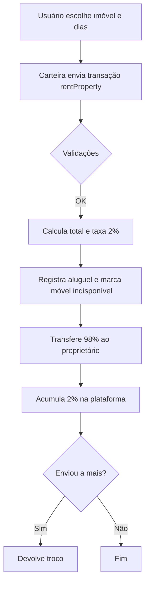

# PropertyRental Smart Contract

Contrato inteligente em Solidity para plataforma de aluguel de imóveis descentralizada, desenvolvido com Foundry.

## 🏠 Funcionalidades

### ✅ **Funcionalidades Principais**

1. **📝 Cadastrar Imóvel** (`registerProperty`)
   - Permite que proprietários cadastrem imóveis na plataforma
   - Armazena descrição, tipo, valor da diária, dias disponíveis e imagem
   - Retorna ID único do imóvel cadastrado

2. **🏠 Alugar Imóvel** (`rentProperty`)
   - Permite que usuários aluguem imóveis por dias específicos
   - Calcula automaticamente valor total e taxa da plataforma (2%)
   - Transfere pagamento para proprietário (descontando taxa)
   - Marca imóvel como indisponível

3. **📋 Listar Todos os Imóveis** (`getAllProperties`)
   - Retorna array com todos os imóveis cadastrados na plataforma
   - Inclui informações completas de cada imóvel

4. **👤 Listar Imóveis do Proprietário** (`getPropertiesByOwner`)
   - Retorna todos os imóveis de um proprietário específico
   - Permite que proprietários vejam seu portfólio

5. **💰 Coletar Taxa da Plataforma** (`collectPlatformFees`)
   - Permite que o dono da plataforma colete as taxas acumuladas (2%)
   - Apenas o owner do contrato pode executar

### 🔒 **Regras de Negócio**

- ❌ Proprietário não pode alugar seu próprio imóvel
- 💰 Taxa fixa de 2% para a plataforma em cada aluguel
- ✅ Validações de entrada em todas as funções
- 🔐 Funções administrativas protegidas por modifier `onlyOwner`

## 🛠️ Estrutura do Projeto

```
src/
├── PropertyRental.sol          # Contrato principal
script/
├── DeployPropertyRental.s.sol  # Script de deploy
test/
├── PropertyRental.t.sol        # Testes completos
```

## 📊 Estruturas de Dados

### Property (Imóvel)
```solidity
struct Property {
    uint256 id;                 // ID único
    address owner;              // Proprietário
    string description;         // Descrição
    string imageUrl;           // URL da imagem
    string propertyType;       // Tipo (apartamento, casa, etc.)
    uint256 dailyRate;         // Valor diário em wei
    uint256 availableDays;     // Dias disponíveis
    bool isAvailable;          // Status de disponibilidade
    uint256 createdAt;         // Timestamp de criação
}
```

### Rental (Aluguel)
```solidity
struct Rental {
    uint256 propertyId;        // ID do imóvel
    address renter;            // Locatário
    uint256 startDate;         // Data de início
    uint256 rentalDays;        // Dias alugados
    uint256 totalAmount;       // Valor total
    bool isActive;             // Status do aluguel
}
```

## 🧪 Testes Implementados

### ✅ **5 Testes Principais**

1. **`test_RegisterProperty_Success`**
   - Testa cadastro de imóvel com sucesso
   - Verifica se dados foram armazenados corretamente

2. **`test_RentProperty_Success`**
   - Testa aluguel de imóvel com sucesso
   - Verifica transferência de valores e taxas

3. **`test_RentProperty_OwnerCannotRentOwnProperty`**
   - Testa regra de negócio: proprietário não pode alugar próprio imóvel

4. **`test_GetAllProperties`**
   - Testa listagem de todos os imóveis da plataforma

5. **`test_CollectPlatformFees`**
   - Testa coleta de taxas pelo dono da plataforma

### 🔴 **Testes de Falha**
- Cadastro com dados inválidos
- Aluguel com valor insuficiente
- Tentativa de alugar imóvel inexistente
- Acesso não autorizado a funções administrativas

## 🚀 Como Usar

### **Pré-requisitos**
```bash
# Instalar Foundry
curl -L https://foundry.paradigm.xyz | bash
foundryup
```

### **Compilar Contrato**
```bash
forge build
```

### **Executar Testes**
```bash
# Todos os testes
forge test

# Testes específicos com verbosidade
forge test --match-test test_RegisterProperty_Success -vvv

# Cobertura de testes
forge coverage
```

### **Deploy Local**
```bash
# Inicia Anvil (blockchain local)
anvil

# Deploy do contrato
forge script script/DeployPropertyRental.s.sol:DeployPropertyRental --rpc-url http://localhost:8545 --private-key 0xac0974bec39a17e36ba4a6b4d238ff944bacb478cbed5efcae784d7bf4f2ff80 --broadcast
```

### **Interagir com o Contrato**
```bash
# Exemplo: Cadastrar imóvel
cast send <CONTRACT_ADDRESS> "registerProperty(string,string,string,uint256,uint256)" "Apartamento moderno" "https://image.url" "apartamento" 50000000000000000 30 --rpc-url http://localhost:8545 --private-key <PRIVATE_KEY>

# Exemplo: Listar todos os imóveis
cast call <CONTRACT_ADDRESS> "getAllProperties()" --rpc-url http://localhost:8545
```

## 📈 Funcionalidades Futuras

- [ ] Sistema de avaliações e comentários
- [ ] Múltiplas moedas suportadas
- [ ] NFTs para representar propriedades
- [ ] Integração com oráculos para preços
- [ ] Sistema de garantia/depósito

## 💡 Observações Técnicas

- **Solidity Version**: ^0.8.19
- **Framework**: Foundry
- **Padrões**: EIP-20 compatível para pagamentos
- **Segurança**: Validações rigorosas e modifiers de proteção
- **Gas Optimization**: Uso eficiente de storage e memory

---

Desenvolvido para o FlashBootcamp - Aula 3 EDU 🚀

## 👶 Guia didático (leigos): entendendo o contrato `PropertyRental.sol`

Esta seção explica, em linguagem simples, como o contrato funciona por dentro. Mesmo sem conhecer Solidity, você conseguirá entender a lógica.

### O que este contrato faz?

- É um "livro-caixa digital" na blockchain para cadastro e aluguel de imóveis.
- Qualquer pessoa pode cadastrar um imóvel e definir preço por diária.
- Outras pessoas podem alugar pagando em ETH. O contrato separa automaticamente uma taxa da plataforma (2%).

### Conceitos rápidos

- **Blockchain**: banco de dados público, que ninguém pode alterar depois que algo é gravado.
- **Smart Contract**: programa que roda na blockchain (sem servidor).
- **ETH e wei**: 1 ETH = 1.000.000.000.000.000.000 wei (18 casas decimais). O contrato usa valores em wei por precisão.
- **Carteira**: sua conta (endereço) que assina e paga transações.

---

### Estruturas de dados principais

- `Property` (um imóvel):
  - **id**: número único do imóvel.
  - **owner**: endereço de quem cadastrou (proprietário).
  - **description**: descrição do imóvel.
  - **imageUrl**: link da foto.
  - **propertyType**: tipo (apartamento, casa, studio, etc.).
  - **dailyRate**: valor da diária em wei.
  - **availableDays**: quantos dias dá para alugar.
  - **isAvailable**: se está disponível agora.
  - **createdAt**: quando foi cadastrado (timestamp).

- `Rental` (um aluguel feito):
  - **propertyId**: qual imóvel foi alugado.
  - **renter**: quem alugou (endereço).
  - **startDate**: quando começou o aluguel.
  - **rentalDays**: quantos dias foram alugados.
  - **totalAmount**: quanto foi pago ao todo (em wei).
  - **isActive**: se o aluguel está ativo.

Além disso, o contrato guarda:
- Uma lista com todos os `propertyId` já criados.
- Os imóveis de cada proprietário.
- Os aluguéis realizados.
- As taxas acumuladas para o dono da plataforma.

---

### Taxa da plataforma (2%)

- O contrato define `PLATFORM_FEE = 200` e `BASIS_POINTS = 10000`.
- Isso significa 200/10000 = **2%** do valor do aluguel vai para a plataforma.
- Exemplo: se o total do aluguel for 1 ETH, a plataforma fica com 0,02 ETH e o dono do imóvel recebe 0,98 ETH.

---

### Eventos (notificações)

O contrato emite eventos para que interfaces (frontends) possam "escutar" o que aconteceu:
- `PropertyRegistered`: quando um imóvel é cadastrado.
- `PropertyRented`: quando um imóvel é alugado.
- `PlatformFeeCollected`: quando a plataforma retira as taxas acumuladas.

---

### Funções explicadas passo a passo

#### 1) Cadastrar imóvel: `registerProperty(...) → propertyId`

Entrada:
- `description` (texto), `imageUrl` (link), `propertyType` (texto), `dailyRate` (preço por dia em wei), `availableDays` (dias).

Regras de validação:
- Descrição não pode ser vazia.
- Tipo do imóvel não pode ser vazio.
- Diária deve ser maior que 0.
- Dias disponíveis deve ser maior que 0.

O que acontece ao cadastrar:
- O contrato gera um novo `id` incremental.
- Salva todos os dados do imóvel.
- Marca como disponível.
- Adiciona esse `id` na lista global e na lista do proprietário.
- Emite `PropertyRegistered`.
- Retorna o `propertyId` (útil para o frontend mostrar/guardar).

Quando usar: quando você (conectado com sua carteira) quer disponibilizar um imóvel para aluguel.

#### 2) Alugar imóvel: `rentProperty(propertyId, days)` (pagável)

Entrada:
- `propertyId` (número do imóvel), `days` (quantos dias quer alugar). A transação deve enviar `msg.value` com o valor total.

Regras de validação:
- O imóvel precisa existir e estar disponível.
- Você não pode alugar seu próprio imóvel.
- `days` deve ser > 0 e ≤ `availableDays` do imóvel.
- `msg.value` (o ETH enviado) precisa ser suficiente para cobrir `dailyRate * days`.

O que acontece ao alugar:
- Calcula o total: `totalCost = dailyRate * days`.
- Calcula taxa da plataforma (2%) e quanto vai para o dono do imóvel.
- Registra o aluguel em `rentals` e marca o imóvel como indisponível.
- Soma a taxa no saldo da plataforma e transfere o restante ao proprietário.
- Se você enviou ETH a mais, o "troco" é devolvido.
- Emite `PropertyRented`.

Quando usar: quando um usuário quer efetivar o aluguel e pagar pelo período escolhido.

#### 3) Listar tudo: `getAllProperties() → Property[]`

- Retorna todos os imóveis cadastrados com dados completos.
- Útil para montar listagens no frontend.

#### 4) Imóveis de um dono: `getPropertiesByOwner(owner) → Property[]`

- Devolve apenas os imóveis pertencentes a um endereço específico.
- Útil para uma "Minha conta / Meus imóveis".

#### 5) Estatísticas: `getPlatformStats() → (totalProperties, totalRentals, platformBalance)`

- Quantos imóveis existem, quantos aluguéis já foram feitos e quanto de taxa a plataforma tem acumulada para saque.

#### 6) Sacar taxas da plataforma: `collectPlatformFees()`

- Só o dono da plataforma (quem fez o deploy) pode chamar.
- Transfere para o `owner` o valor acumulado das taxas (se houver).
- Emite `PlatformFeeCollected`.

---

### Regras de segurança embutidas

- Proprietário não pode alugar o próprio imóvel.
- Entradas são validadas (campos obrigatórios e números > 0).
- Pagamento insuficiente é rejeitado.
- Apenas o `owner` do contrato consegue sacar taxas.

---

### Erros comuns e como interpretar

- "Descricao nao pode estar vazia" → Preencha a descrição ao cadastrar.
- "Tipo do imovel nao pode estar vazio" → Selecione/insira o tipo.
- "Valor da diaria deve ser maior que zero" → Informe um preço positivo.
- "Dias disponiveis deve ser maior que zero" → Informe dias válidos.
- "Imovel nao esta disponivel" → Já foi alugado ou marcado como indisponível.
- "Proprietario nao pode alugar seu proprio imovel" → Tente alugar outro imóvel.
- "Quantidade de dias invalida" → Dias devem ser > 0 e dentro do limite disponível.
- "Valor enviado insuficiente" → Envie ETH suficiente para `dailyRate * days`.

---

### Como um aluguel acontece (história rápida)

1) Ana cadastrou um apartamento por 0,05 ETH/dia, com 10 dias disponíveis.

2) Bruno quer alugar por 3 dias:
- A carteira do Bruno calcula o total (0,15 ETH) e envia junto com a chamada `rentProperty`.
- O contrato separa 2% (0,003 ETH) para a plataforma e manda 0,147 ETH para a Ana.
- O imóvel fica temporariamente indisponível.

3) A plataforma pode sacar a taxa acumulada quando quiser usando `collectPlatformFees` (somente o dono do contrato).

---

### Glossário rápido

- **Owner (do contrato)**: quem fez o deploy; controla o saque das taxas.
- **Owner (do imóvel)**: quem cadastrou o imóvel; recebe os aluguéis.
- **Evento**: notificação emitida pelo contrato que frontends podem ler em tempo real.
- **Wei**: unidade mínima de ETH (como "centavos", mas com 18 casas decimais).

---

### Referência de funções (resumo amigável)

- `registerProperty(desc, img, tipo, diariaWei, dias) → id`
- `rentProperty(propertyId, days)` (pagável com ETH)
- `getAllProperties() → Property[]`
- `getPropertiesByOwner(owner) → Property[]`
- `getPlatformStats() → (totalProperties, totalRentals, platformBalance)`
- `collectPlatformFees()` (somente owner do contrato)
- `getProperty(propertyId) → Property` (detalhes de um imóvel)
- `getOwnerPropertyCount(owner) → uint256` (quantidade de imóveis do proprietário)

> Dica: no frontend, converta ETH ↔ wei para exibir valores amigáveis e enviar transações corretas.

---

## 🔍 Análise Detalhada das Funções (Código Explicado)

Esta seção detalha cada função do contrato `PropertyRental.sol`, explicando linha por linha o que cada parte faz.

### 📋 Constructor (Inicialização do Contrato)

```solidity
constructor() {
    owner = msg.sender;
    propertyCounter = 0;
    rentalCounter = 0;
}
```

**Explicação detalhada:**
- `owner = msg.sender`: Define quem está fazendo o deploy como dono da plataforma
- `msg.sender`: Endereço de quem executa a transação (quem está pagando o gas)
- `propertyCounter = 0`: Inicializa contador de imóveis em zero
- `rentalCounter = 0`: Inicializa contador de aluguéis em zero
- **Quando executa:** Apenas uma vez, no momento do deploy do contrato

---

### 🏠 Função `registerProperty` (Cadastrar Imóvel)

```solidity
function registerProperty(
    string memory _description,
    string memory _imageUrl,
    string memory _propertyType,
    uint256 _dailyRate,
    uint256 _availableDays
) external returns (uint256) {
```

**Assinatura da função:**
- `external`: Pode ser chamada de fora do contrato (por usuários)
- `returns (uint256)`: Retorna o ID do imóvel cadastrado
- Todos os parâmetros são obrigatórios

**Validações de entrada:**
```solidity
require(bytes(_description).length > 0, "Descricao nao pode estar vazia");
require(bytes(_propertyType).length > 0, "Tipo do imovel nao pode estar vazio");
require(_dailyRate > 0, "Valor da diaria deve ser maior que zero");
require(_availableDays > 0, "Dias disponiveis deve ser maior que zero");
```

**Explicação das validações:**
- `bytes(_description).length > 0`: Converte string para bytes e verifica se não está vazia
- `require()`: Se a condição for falsa, reverte a transação e mostra a mensagem de erro
- Valida que `_dailyRate` e `_availableDays` sejam números positivos

**Geração de ID único:**
```solidity
propertyCounter++;
uint256 newPropertyId = propertyCounter;
```

**Explicação:**
- `propertyCounter++`: Incrementa o contador (de 0 para 1, depois 1 para 2, etc.)
- Garante que cada imóvel tenha um ID único e sequencial
- Primeiro imóvel = ID 1, segundo = ID 2, etc.

**Criação da estrutura Property:**
```solidity
properties[newPropertyId] = Property({
    id: newPropertyId,
    owner: msg.sender,
    description: _description,
    imageUrl: _imageUrl,
    propertyType: _propertyType,
    dailyRate: _dailyRate,
    availableDays: _availableDays,
    isAvailable: true,
    createdAt: block.timestamp
});
```

**Explicação:**
- `properties[newPropertyId]`: Armazena no mapping usando o ID como chave
- `msg.sender`: Quem está cadastrando se torna o proprietário
- `isAvailable: true`: Marca como disponível por padrão
- `block.timestamp`: Timestamp Unix do bloco atual (quando foi cadastrado)

**Atualizações dos arrays de controle:**
```solidity
ownerProperties[msg.sender].push(newPropertyId);
allPropertyIds.push(newPropertyId);
```

**Explicação:**
- `ownerProperties[msg.sender].push()`: Adiciona o ID na lista de imóveis do proprietário
- `allPropertyIds.push()`: Adiciona o ID na lista global de todos os imóveis
- Essas listas facilitam buscar imóveis depois

**Evento e retorno:**
```solidity
emit PropertyRegistered(newPropertyId, msg.sender, _propertyType, _dailyRate);
return newPropertyId;
```

**Explicação:**
- `emit PropertyRegistered()`: Emite evento que frontends podem "escutar"
- `return newPropertyId`: Devolve o ID para quem chamou a função

---

### 💰 Função `rentProperty` (Alugar Imóvel)

```solidity
function rentProperty(uint256 _propertyId, uint256 _days) 
    external 
    payable 
    propertyExists(_propertyId) 
{
```

**Assinatura da função:**
- `payable`: Pode receber ETH junto com a chamada
- `propertyExists(_propertyId)`: Modifier que verifica se o imóvel existe

**Acesso à propriedade:**
```solidity
Property storage property = properties[_propertyId];
```

**Explicação:**
- `storage`: Referência direta aos dados armazenados (não cópia)
- Permite modificar a propriedade diretamente
- `property` é um "ponteiro" para `properties[_propertyId]`

**Validações de negócio:**
```solidity
require(property.isAvailable, "Imovel nao esta disponivel");
require(property.owner != msg.sender, "Proprietario nao pode alugar seu proprio imovel");
require(_days > 0 && _days <= property.availableDays, "Quantidade de dias invalida");
```

**Explicação:**
- Verifica se está disponível para aluguel
- Impede que proprietário alugue seu próprio imóvel
- Valida que os dias estão dentro do limite disponível

**Cálculos financeiros:**
```solidity
uint256 totalCost = property.dailyRate * _days;
uint256 platformFee = (totalCost * PLATFORM_FEE) / BASIS_POINTS;
uint256 ownerAmount = totalCost - platformFee;
```

**Explicação:**
- `totalCost`: Valor total (diária × dias)
- `platformFee`: Taxa de 2% → (total × 200) ÷ 10000 = 2%
- `ownerAmount`: O que sobra para o proprietário (98%)

**Validação do pagamento:**
```solidity
require(msg.value >= totalCost, "Valor enviado insuficiente");
```

**Explicação:**
- `msg.value`: Quantidade de ETH enviada com a transação
- Deve ser suficiente para cobrir o custo total

**Registro do aluguel:**
```solidity
rentalCounter++;
rentals[rentalCounter] = Rental({
    propertyId: _propertyId,
    renter: msg.sender,
    startDate: block.timestamp,
    rentalDays: _days,
    totalAmount: totalCost,
    isActive: true
});
```

**Explicação:**
- Cria registro único do aluguel com ID incremental
- `renter: msg.sender`: Quem está alugando
- `startDate: block.timestamp`: Quando começou

**Atualizações de estado:**
```solidity
property.isAvailable = false;
platformEarnings[owner] += platformFee;
```

**Explicação:**
- Marca o imóvel como indisponível
- Adiciona a taxa (2%) ao saldo da plataforma

**Transferências de ETH:**
```solidity
payable(property.owner).transfer(ownerAmount);

if (msg.value > totalCost) {
    payable(msg.sender).transfer(msg.value - totalCost);
}
```

**Explicação:**
- `payable()`: Converte endereço para poder receber ETH
- `.transfer()`: Envia ETH de forma segura
- Segunda transferência: devolve "troco" se enviou ETH a mais

**Evento:**
```solidity
emit PropertyRented(_propertyId, rentalCounter, msg.sender, _days, totalCost);
```

---

### 📊 Função `getAllProperties` (Listar Todos)

```solidity
function getAllProperties() external view returns (Property[] memory) {
    Property[] memory allProperties = new Property[](allPropertyIds.length);
    
    for (uint256 i = 0; i < allPropertyIds.length; i++) {
        allProperties[i] = properties[allPropertyIds[i]];
    }
    
    return allProperties;
}
```

**Explicação detalhada:**
- `view`: Função só de leitura, não modifica estado
- `Property[] memory`: Array temporário de propriedades
- `new Property[](tamanho)`: Cria array com tamanho fixo
- Loop percorre `allPropertyIds` e copia cada propriedade
- Retorna array completo com todos os imóveis

---

### 👤 Função `getPropertiesByOwner` (Imóveis do Proprietário)

```solidity
function getPropertiesByOwner(address _owner) external view returns (Property[] memory) {
    uint256[] memory ownerPropertyIds = ownerProperties[_owner];
    Property[] memory ownerProps = new Property[](ownerPropertyIds.length);
    
    for (uint256 i = 0; i < ownerPropertyIds.length; i++) {
        ownerProps[i] = properties[ownerPropertyIds[i]];
    }
    
    return ownerProps;
}
```

**Explicação detalhada:**
- Similar a `getAllProperties`, mas filtra por proprietário
- `ownerProperties[_owner]`: Pega lista de IDs do proprietário específico
- Loop cria array apenas com imóveis desse proprietário

---

### 💸 Função `collectPlatformFees` (Sacar Taxas)

```solidity
function collectPlatformFees() external onlyOwner {
    uint256 amount = platformEarnings[owner];
    require(amount > 0, "Nenhuma taxa disponivel para coleta");
    
    platformEarnings[owner] = 0;
    payable(owner).transfer(amount);
    
    emit PlatformFeeCollected(amount, owner);
}
```

**Explicação detalhada:**
- `onlyOwner`: Modifier que só permite execução pelo dono da plataforma
- `amount`: Quantidade de ETH acumulada das taxas (2% de cada aluguel)
- Validação: só executa se há saldo para sacar
- `platformEarnings[owner] = 0`: Zera o saldo antes da transferência (padrão de segurança)
- `payable(owner).transfer(amount)`: Envia ETH para o dono da plataforma
- Emite evento para notificar a operação

---

### 📈 Função `getPlatformStats` (Estatísticas)

```solidity
function getPlatformStats() external view returns (
    uint256 totalProperties,
    uint256 totalRentals,
    uint256 platformBalance
) {
    return (
        propertyCounter,
        rentalCounter,
        platformEarnings[owner]
    );
}
```

**Explicação detalhada:**
- Retorna múltiplos valores de uma vez
- `propertyCounter`: Total de imóveis já cadastrados
- `rentalCounter`: Total de aluguéis já realizados
- `platformEarnings[owner]`: Saldo de taxas acumuladas

---

### 🔒 Modifiers de Segurança

**Modifier `onlyOwner`:**
```solidity
modifier onlyOwner() {
    require(msg.sender == owner, "Apenas o dono da plataforma pode executar esta funcao");
    _;
}
```

**Explicação:**
- `modifier`: Código reutilizável que executa antes da função
- Verifica se quem chama é o dono da plataforma
- `_`: Placeholder onde o código da função será executado
- Se não for o owner, reverte com mensagem de erro

**Modifier `propertyExists`:**
```solidity
modifier propertyExists(uint256 _propertyId) {
    require(_propertyId > 0 && _propertyId <= propertyCounter, "Imovel nao existe");
    _;
}
```

**Explicação:**
- Valida se o ID do imóvel é válido
- `_propertyId > 0`: IDs começam em 1 (não zero)
- `_propertyId <= propertyCounter`: Não pode ser maior que o último ID criado

---

### 🎯 Padrões de Segurança Utilizados

1. **Checks-Effects-Interactions:**
   - Primeiro: validações (`require`)
   - Segundo: mudanças de estado
   - Terceiro: interações externas (`.transfer()`)

2. **Reentrancy Protection:**
   - Atualiza saldos antes de transferir ETH
   - Exemplo: `platformEarnings[owner] = 0` antes de `transfer()`

3. **Overflow Protection:**
   - Solidity ^0.8.19 tem proteção automática contra overflow
   - Operações matemáticas revertem se resultado for inválido

4. **Access Control:**
   - Modifiers para controlar quem pode executar funções
   - Separação entre funções públicas e administrativas

---

### 💡 Otimizações de Gas

1. **Storage vs Memory:**
   - `Property storage property`: Referência direta (barato)
   - `Property[] memory`: Array temporário (mais caro, mas necessário para retorno)

2. **Packed Structs:**
   - Organização dos campos para economizar slots de storage
   - `bool isAvailable` junto com outros campos pequenos

3. **Loops Limitados:**
   - Arrays de IDs evitam loops grandes
   - Busca direta por mapping O(1) vs loop O(n)

Esta análise detalhada mostra como cada linha de código contribui para a funcionalidade e segurança do contrato! 🚀

---

## 👶 Guia completo para iniciantes (passo a passo didático)

Esta seção é para quem está começando do zero. Você não precisa saber programar para acompanhar.

### 1) O que é este projeto?

- **Plataforma de aluguel de imóveis** que roda na blockchain (sem servidor).
- Você pode **cadastrar** um imóvel (definindo preço por dia) e outras pessoas podem **alugar** pagando em ETH.
- O contrato separa automaticamente **2%** de cada aluguel para a plataforma.

### 2) O que você precisa instalar (uma vez só)

1. Instale o Foundry (ferramentas para Ethereum):
```bash
curl -L https://foundry.paradigm.xyz | bash
foundryup
```
2. Opcional: Node.js e uma carteira (ex.: MetaMask) se for integrar com frontend.

### 3) Como rodar localmente, em 3 passos

1. Inicie uma blockchain local:
```bash
anvil
```
2. Em outro terminal, faça o deploy do contrato:
```bash
forge script script/DeployPropertyRental.s.sol:DeployPropertyRental \
  --rpc-url http://localhost:8545 \
  --private-key 0xac0974bec39a17e36ba4a6b4d238ff944bacb478cbed5efcae784d7bf4f2ff80 \
  --broadcast
```
3. Guarde o endereço do contrato exibido ao final do deploy. Você usará esse endereço nos comandos abaixo como `<CONTRACT_ADDRESS>`.

### 4) Exemplos de uso (copiar e colar)

- Cadastrar um imóvel (0,05 ETH/dia, 30 dias):
```bash
cast send <CONTRACT_ADDRESS> \
  "registerProperty(string,string,string,uint256,uint256)" \
  "Apartamento moderno" "https://image.url" "apartamento" 50000000000000000 30 \
  --rpc-url http://localhost:8545 --private-key <PRIVATE_KEY>
```

- Listar todos os imóveis cadastrados:
```bash
cast call <CONTRACT_ADDRESS> "getAllProperties()" \
  --rpc-url http://localhost:8545
```

- Ver detalhes de um imóvel específico (ex.: ID 1):
```bash
cast call <CONTRACT_ADDRESS> "getProperty(uint256)" 1 \
  --rpc-url http://localhost:8545
```

- Ver estatísticas da plataforma:
```bash
cast call <CONTRACT_ADDRESS> "getPlatformStats()" \
  --rpc-url http://localhost:8545
```

### 5) Exemplo numérico completo (com troco)

Imagine que a diária é `0,05 ETH` e você quer alugar por `3 dias`:

- Total do aluguel: `0,05 × 3 = 0,15 ETH`
- Taxa da plataforma (2%): `0,15 × 0,02 = 0,003 ETH`
- Valor para o proprietário: `0,15 − 0,003 = 0,147 ETH`

Se você, por engano, enviar `0,16 ETH` na transação, o contrato:
- transfere `0,147 ETH` ao proprietário,
- soma `0,003 ETH` ao saldo da plataforma,
- e devolve `0,01 ETH` de troco para você automaticamente.

### 6) Como pensar em ETH e wei (sem erro)

- 1 ETH = 1.000.000.000.000.000.000 wei (1e18 wei).
- Para definir preço: multiplique o valor em ETH por 1e18 para obter wei.
- Exemplos:
  - 0,05 ETH = `0,05 × 1e18 = 50000000000000000 wei`.
  - 0,1 ETH = `0,1 × 1e18 = 100000000000000000 wei`.

### 7) Entendendo mensagens de erro comuns (tradução simples)

- "Descricao nao pode estar vazia" → Preencha uma descrição para o imóvel.
- "Tipo do imovel nao pode estar vazio" → Informe o tipo (apartamento, casa, etc.).
- "Valor da diaria deve ser maior que zero" → Use preço positivo.
- "Dias disponiveis deve ser maior que zero" → Informe um número de dias válido.
- "Imovel nao esta disponivel" → Já foi alugado ou está bloqueado.
- "Proprietario nao pode alugar seu proprio imovel" → Tente outro imóvel.
- "Quantidade de dias invalida" → Dias devem ser > 0 e ≤ dias disponíveis.
- "Valor enviado insuficiente" → Envie ETH ≥ diária × dias.

### 8) Visualizando eventos (o que o contrato anuncia)

O contrato emite eventos para facilitar integrações:
- `PropertyRegistered(propertyId, owner, propertyType, dailyRate)`
- `PropertyRented(propertyId, rentalId, renter, rentalDays, totalAmount)`
- `PlatformFeeCollected(amount, to)`

Em um frontend, você pode “ouvir” esses eventos para atualizar a interface em tempo real. Em testes/CLI, rode operações e consulte o estado com `cast call` após as transações.

### 9) Diagrama rápido do fluxo de aluguel



### 10) Dúvidas frequentes (FAQ)

- Posso alugar meu próprio imóvel?
  - Não. O contrato bloqueia essa ação.

- O que acontece se eu enviar ETH a mais?
  - O contrato devolve automaticamente o excedente (troco).

- Como a plataforma recebe as taxas?
  - As taxas de 2% ficam acumuladas e o dono do contrato coleta com `collectPlatformFees()`.

- Como vejo quantos imóveis já foram cadastrados/alugados?
  - Chame `getPlatformStats()`.

- O que é `wei`? Por que não usar ETH direto?
  - `wei` é a menor unidade de ETH (como “centavos”). Usamos `wei` para evitar erros de arredondamento.

### 11) Integração mínima com frontend

- Listar imóveis: chame `getAllProperties()` e exiba `description`, `imageUrl`, `propertyType`, `dailyRate` (converta de wei para ETH) e `isAvailable`.
- Alugar: peça `days` ao usuário, calcule `dailyRate × days` e envie `rentProperty(propertyId, days)` com `msg.value = totalCost`.
- Mostrar taxa/estatísticas: use `getPlatformStats()`.

> Dica: No frontend, converta valores com utilitários da sua biblioteca web3 (ex.: `ethers.parseEther` e `ethers.formatEther`).

---

## 🔐 Nota rápida de segurança (para leigos)

- Nunca compartilhe sua chave privada.
- Em redes públicas, valores são reais: teste primeiro em rede local ou de teste.
- As mensagens de erro existem para proteger seu dinheiro. Leia-as e ajuste a operação.
